# KHẢO SÁT TOÀN DIỆN Sá»° PHÁT TRIỂN CỦA YOLO
## Từ YOLOv1 (2015) đến YOLO26 (2026): Kiến trúc — Phương pháp — Kết quả — Xu hướng

**Tác giả:** Nguyễn Cao Trị  
**Ngày biên soạn:** 14/05/2026

---

# MỤC LỤC

1. [Mở đầu](#chương-1-mở-đầu)
2. [Nền tảng Lý thuyết](#chương-2-nền-tảng-lý-thuyết)
3. [Thế hệ Đầu: YOLOv1–v4 (2015–2020)](#chương-3-thế-hệ-đầu-yolov1v4)
4. [Thế hệ Giữa: YOLOv5–v8 (2020–2023)](#chương-4-thế-hệ-giữa-yolov5v8)
5. [Thế hệ Mới: YOLOv9–v12 (2024–2025)](#chương-5-thế-hệ-mới-yolov9v12)
6. [Mở rộng: YOLOE & YOLO26](#chương-6-mở-rộng-yoloe--yolo26)
7. [Các biến thể YOLO](#chương-7-các-biến-thể-yolo)
8. [So sánh Tổng hợp & Đánh giá](#chương-8-so-sánh-tổng-hợp--đánh-giá)
9. [Kết luận & Khuyến nghị](#chương-9-kết-luận--khuyến-nghị)
10. [Phụ lục: Bảng Thuật ngữ](#phụ-lục-bảng-thuật-ngữ)
11. [Tài liệu Tham khảo](#tài-liệu-tham-khảo)

---

# Chương 1: MỞ ĐẦU

## 1.1. Giới thiệu bài toán Object Detection

Phát hiện vật thể (Object Detection) là một trong những bài toán trung tâm của thị giác máy tính (Computer Vision). Mục tiêu là xác định **vị trí** (bounding box) và **loại** (class) của tất cả vật thể trong ảnh hoặc video. Lĩnh vực này được ứng dụng rộng rãi trong xe tự hành, giám sát an ninh, y tế, công nghiệp và nông nghiệp.

Trước khi YOLO ra đời (2015), các phương pháp detection chủ đạo là **two-stage detectors**:

- **R-CNN** (2014): Dùng Selective Search tạo ~2000 vùng đề xuất (region proposals), mỗi vùng qua CNN trích features, rồi SVM phân loại. Cực chậm: **>40 giây/ảnh**.
- **Fast R-CNN** (2015): Cải tiến bằng cách chia sẻ CNN features cho tất cả vùng, nhưng vẫn phụ thuộc Selective Search.
- **Faster R-CNN** (2015): Thay Selective Search bằng Region Proposal Network (RPN) học được, nhưng vẫn là pipeline **2 giai đoạn rời rạc**.

> **Ẩn dụ:** Các phương pháp two-stage giống như **bảo vệ tòa nhà kiểm tra 2 lần**: lần 1 liếc qua đánh dấu 2000 người "nghi ngờ", lần 2 gọi từng người kiểm tra căn cước → chính xác nhưng cực chậm.

## 1.2. YOLO — Bước ngoặt lịch sử

**YOLO (You Only Look Once)** ra đời năm 2015, thay đổi hoàn toàn cách tiếp cận: coi object detection là **bài toán hồi quy duy nhất** (single regression problem) — từ pixel ảnh trực tiếp ra bounding boxes và class probabilities, chỉ qua **một lần forward pass** → real-time (45 FPS) [1].

> **Ẩn dụ:** YOLO giống bạn **liếc mắt 1 cái** vào phòng: "Góc trái có cái bàn, giữa có con mèo, bên phải có cái ghế" — biết ngay **cái gì + ở đâu**, chỉ qua 1 lần nhìn.

Từ 2015 đến 2026, YOLO đã trải qua **14 phiên bản chính** (v1–v12, YOLOE, YOLO26) và nhiều biến thể, với mAP tăng từ 63.4% (VOC) lên ~57.2% (COCO — benchmark khó hơn nhiều), tốc độ từ 45 FPS lên hàng trăm FPS.

## 1.3. Mục tiêu và phạm vi báo cáo

**Mục tiêu:** Khảo sát toàn diện sự phát triển của YOLO qua các đời, phân tích kiến trúc, phương pháp, kết quả, ưu/nhược điểm, và xu hướng tương lai.

**Phạm vi:**
- Dòng chính: YOLOv1 → YOLOv12, YOLOE, YOLO26
- Biến thể: YOLOX, PP-YOLOE, YOLO-NAS, YOLO-World
- So sánh đa chiều và khuyến nghị lựa chọn

---

# Chương 2: NỀN TẢNG LÝ THUYẾT

## 2.1. Pipeline Object Detection hiện đại

Một detector hiện đại gồm 3 phần:

| Thành phần | Chức năng | Ví dụ |
|:--|:--|:--|
| **Backbone** | Trích xuất features từ ảnh | Darknet, CSPDarknet, ResNet |
| **Neck** | Kết hợp features ở nhiều scales | FPN, PAN, BiFPN |
| **Head** | Dự đoán bounding boxes và classes | Coupled / Decoupled head |

> **Ẩn dụ:** Backbone giống **mắt** (nhìn và nhận diện đặc trưng), Neck giống **não bộ** (tổng hợp thông tin từ nhiều góc nhìn), Head giống **miệng** (nói ra đáp án cuối cùng).

[📌 YÊU CẦU CHÈN ẢNH: Tác giả hãy chèn sơ đồ khối tổng quát Backbone → Neck → Head của một YOLO detector hiện đại.]

## 2.2. One-stage vs Two-stage Detectors

| Tiêu chí | Two-stage (Faster R-CNN) | One-stage (YOLO, SSD) |
|:--|:--|:--|
| Tốc độ | Chậm (5–20 FPS) | Nhanh (30–300 FPS) |
| Accuracy | Cao hơn (trước 2020) | Bắt kịp từ YOLOv4+ [4] |
| Pipeline | 2 giai đoạn rời rạc | End-to-end |

## 2.3. Các khái niệm cốt lõi

### 2.3.1. IoU (Intersection over Union)

Đo mức trùng lặp giữa predicted box (B_p) và ground truth (B_gt):

$$\text{IoU} = \frac{|B_p \cap B_{gt}|}{|B_p \cup B_{gt}|}$$

> **Ẩn dụ:** Tưởng tượng 2 tờ giấy đặt chồng lên nhau. IoU = *diện tích phần chồng* chia cho *tổng diện tích cả 2 tờ (đếm 1 lần)*. IoU = 1.0 nghĩa là 2 tờ trùng khít hoàn hảo.

### 2.3.2. mAP (mean Average Precision)

- **mAP@50:** Tính Average Precision ở ngưỡng IoU ≥ 0.5. Metric chính trên PASCAL VOC.
- **mAP@50:95:** Trung bình AP ở IoU từ 0.5 đến 0.95 (bước 0.05) — metric chính trên MS COCO, khắt khe hơn nhiều.

### 2.3.3. Anchor Boxes

Các hộp mẫu (templates) được định nghĩa trước với kích thước và tỷ lệ khác nhau. Model dự đoán **offsets** so với anchors thay vì tọa độ tuyệt đối.

> **Ẩn dụ:** Anchor giống đi **may đồ chọn size S/M/L có sẵn**, rồi chỉ cần sửa lai cho vừa — nhanh và chính xác hơn so với đo từ đầu (anchor-free).

### 2.3.4. NMS (Non-Maximum Suppression)

Thuật toán loại bỏ bounding boxes trùng lặp: giữ box có confidence cao nhất, bỏ các boxes có IoU lớn với box đã chọn.

### 2.3.5. Tiến hóa Loss Function

| Loss | Phiên bản | Đặc điểm |
|:--|:--|:--|
| MSE/SSE | v1–v3 | Đơn giản, coi box lớn/nhỏ ngang nhau |
| GIoU | v6 | Xét cả vùng bao ngoài khi 2 box không giao |
| CIoU | v4–v8 | + khoảng cách tâm + tỷ lệ khung hình |
| DFL | v8–v12 | Dự đoán phân phối xác suất thay vì giá trị đơn |
| Bỏ DFL | YOLO26 | Quay về dự đoán trực tiếp, bù bằng training tricks |

### 2.3.6. Datasets chuẩn

- **PASCAL VOC** (2007/2012): 20 classes, ~10K ảnh. Metric: mAP@50.
- **MS COCO:** 80 classes, 330K ảnh. Metric: mAP@50:95. Benchmark chính từ v3+.
- **LVIS:** 1203 categories. Dùng cho open-vocabulary evaluation (YOLOE) [13].

---

# Chương 3: THẾ HỆ ĐẦU — YOLOv1–v4 (2015–2020)

## 3.1. YOLOv1 (2015) — Khởi nguồn

**Paper:** "You Only Look Once: Unified, Real-Time Object Detection" (CVPR 2016) [1]  
**Tác giả:** Joseph Redmon, Santosh Divvala, Ross Girshick, Ali Farhadi

### 3.1.1. Ý tưởng cốt lõi

Chia ảnh thành lưới **S × S** (S=7), mỗi ô dự đoán **B=2** bounding boxes và **C=20** class probabilities. Toàn bộ pipeline là **một mạng neural duy nhất**, end-to-end.

### 3.1.2. Kiến trúc

24 lớp convolutional + 2 lớp fully connected. Output: tensor **7 × 7 × 30**.

[📌 YÊU CẦU CHÈN ẢNH: Tác giả hãy chèn sơ đồ kiến trúc YOLOv1 từ paper gốc (Figure 3, Redmon et al. 2016) [1].]

### 3.1.3. Hàm Loss (5 thành phần)

$$\mathcal{L} = \lambda_{\text{coord}} \sum_{i=0}^{S^2}\sum_{j=0}^{B} \mathbb{1}_{ij}^{\text{obj}} \left[ (x_i - \hat{x}_i)^2 + (y_i - \hat{y}_i)^2 + (\sqrt{w_i} - \sqrt{\hat{w}_i})^2 + (\sqrt{h_i} - \sqrt{\hat{h}_i})^2 \right]$$

$$+ \sum_{i}\sum_{j} \mathbb{1}_{ij}^{\text{obj}}(C_i - \hat{C}_i)^2 + \lambda_{\text{noobj}} \sum_{i}\sum_{j} \mathbb{1}_{ij}^{\text{noobj}}(C_i - \hat{C}_i)^2 + \sum_{i} \mathbb{1}_{i}^{\text{obj}} \sum_{c \in \text{classes}} (p_i(c) - \hat{p}_i(c))^2$$

Trong đó: λ_coord = 5, λ_noobj = 0.5. Dùng √w, √h để **giảm ảnh hưởng sai số** ở box lớn [1].

### 3.1.4. Kết quả

| Model | mAP (VOC 2007) | FPS |
|:--|:-:|:-:|
| Fast YOLO | 52.7% | 155 |
| YOLO | 63.4% | 45 |
| YOLO VGG-16 | 66.4% | 21 |
| Faster R-CNN | 70.0% | 0.5 |

*Ghi chú: FPS đo trên Titan X (Maxwell). Không so sánh trực tiếp với FPS thế hệ GPU sau.*

**Ưu điểm:** Real-time đầu tiên; ít false positive background; tổng quát hóa tốt (Picasso dataset: 53.3% vs R-CNN 10.2%) [1].  
**Nhược điểm:** Vật nhỏ kém (grid thô 7×7); localization sai nhiều; mỗi ô chỉ dự đoán 1 class.

---

## 3.2. YOLOv2 / YOLO9000 (2016) — Better, Faster, Stronger

**Paper:** "YOLO9000: Better, Faster, Stronger" (CVPR 2017) [2]  
**Tác giả:** Joseph Redmon, Ali Farhadi

### 3.2.1. Cải tiến tích lũy

| # | Kỹ thuật | mAP (%) | Thay đổi |
|:-:|:--|:-:|:--|
| 0 | Baseline (v1) | 63.4 | — |
| 1 | + Batch Normalization | 65.4 | +2.0 |
| 2 | + High-Res Classifier (448) | 69.4 | +4.0 |
| 3 | + Anchor Boxes (5 anchors) | 69.2 | Recall +7% |
| 4 | + Dimension Clusters (k-means) | — | IoU tốt hơn |
| 5 | + Direct Location (sigmoid) | 74.4 | +5.0 |
| 6 | + Passthrough (26×26→13×13) | 75.4 | +1.0 |
| 7 | + Multi-Scale Training | 76.8 | +1.4 |
| | **YOLOv2 (416×416)** | **76.8** | **+13.4** |

### 3.2.2. Darknet-19 & YOLO9000

Backbone mới: 19 conv + 5 maxpool, chỉ **5.58B FLOPs** (VGG-16: 30.69B — nhanh gấp 5×). YOLO9000 dùng **WordTree** joint training trên COCO + ImageNet → detect **9000+ categories** [2].

---

## 3.3. YOLOv3 (2018) — Multi-Scale Detection

**Paper:** "YOLOv3: An Incremental Improvement" (Tech Report) [3]  
**Tác giả:** Joseph Redmon, Ali Farhadi *(paper cuối cùng của Redmon trước khi dừng nghiên cứu CV vì lo ngại đạo đức)*

### 3.3.1. Đột phá: 3 Scales

Dự đoán ở **3 scales** (13×13, 26×26, 52×52) theo FPN-style, mỗi scale 3 anchors = 9 anchors tổng. Thay Softmax bằng **Sigmoid** cho multi-label classification [3].

> **Ẩn dụ:** v1–v2 nhìn qua 1 ống kính. v3 nhìn qua **3 ống kính zoom khác nhau** cùng lúc: zoom xa (vật lớn), trung bình, zoom gần (vật nhỏ).

### 3.3.2. Darknet-53

53 conv layers + residual connections. Chính xác bằng ResNet-152 nhưng **nhanh gấp 2×** (78 vs 37 FPS) [3].

**Kết quả:** mAP@50: 57.9% (COCO), ngang RetinaNet nhưng nhanh gấp 3.8×. mAP@50:95: 33.0%.

---

## 3.4. YOLOv4 (2020) — Tập đại thành

**Paper:** "YOLOv4: Optimal Speed and Accuracy of Object Detection" [4]  
**Tác giả:** Alexey Bochkovskiy, Chien-Yao Wang, Hong-Yuan Mark Liao

### 3.4.1. Phương pháp luận: BoF & BoS

| Nhóm | Ý nghĩa | Kỹ thuật tiêu biểu |
|:--|:--|:--|
| **Bag of Freebies** | Chỉ tăng training cost | Mosaic, CutMix, CIoU Loss, Label Smoothing, SAT |
| **Bag of Specials** | Tăng nhẹ inference cost | Mish activation, SPP, SAM, PAN, DIoU-NMS |

> **Ẩn dụ:** BoF giống **đầu bếp gom tất cả công thức hay nhất thế giới** vào 1 cuốn sách. Không cần phát minh mới, chỉ cần biết chọn và kết hợp đúng.

### 3.4.2. Kiến trúc: CSPDarknet53 + SPP + PAN

- **CSP (Cross Stage Partial):** Chia features thành 2 phần, chỉ 1 phần qua processing → giảm **20% computation** mà giữ accuracy.
- **SPP:** MaxPool nhiều kích thước → tăng receptive field.
- **PAN:** Bottom-up pathway bổ sung cho FPN → localization signals mạnh hơn.

[📌 YÊU CẦU CHÈN ẢNH: Tác giả hãy chèn sơ đồ kiến trúc YOLOv4 (CSPDarknet53 + SPP + PAN) từ paper gốc [4].]

### 3.4.3. Kỹ thuật nổi bật

**Mosaic Augmentation:** Ghép 4 ảnh ngẫu nhiên thành 1 ảnh → model thấy nhiều context, giảm batch size cần thiết [4].

**CIoU Loss:**

$$\mathcal{L}_{\text{CIoU}} = 1 - \text{IoU} + \frac{\rho^2(\mathbf{b}, \mathbf{b}^{gt})}{c^2} + \alpha v$$

Trong đó: ρ = khoảng cách Euclid giữa 2 tâm, c = đường chéo vùng bao, v = hệ số aspect ratio, α = hệ số cân bằng [4].

> **Ẩn dụ:** IoU chỉ đo "2 box chồng bao nhiêu %". CIoU đo thêm "2 tâm box cách nhau bao xa" và "hình dạng 2 box có giống nhau không" → toàn diện hơn.

### 3.4.4. Kết quả

**43.5% mAP** (COCO), ~65 FPS (V100). Nhảy vọt **+10.5%** so với v3 — bước nhảy lớn nhất lịch sử YOLO [4]. Train được trên **single GPU** (8–16 GB).

*Ghi chú: FPS đo trên V100 GPU. Không so sánh trực tiếp với FPS đo trên Titan X (v1–v3).*
# Chương 4: THẾ HỆ GIỮA — YOLOv5–v8 (2020–2023)

## 4.1. YOLOv5 (2020) — Dân chủ hóa YOLO

**Tác giả:** Glenn Jocher / Ultralytics | **Framework:** PyTorch | *Không có paper chính thức* [5]

### 4.1.1. Ý nghĩa lịch sử

Chuyển từ Darknet (C) sang PyTorch. Gây tranh cãi vì không có paper, nhưng trở thành **YOLO phổ biến nhất** nhờ `pip install ultralytics`.

> **Ẩn dụ:** Trước v5, dùng YOLO giống phải **lái xe số sàn** (compile C code, cấu hình .cfg). v5 chuyển sang **xe số tự động** — 3 dòng Python là chạy.

### 4.1.2. Kiến trúc

- **Backbone:** CSPDarknet53 (modified) với **C3 module** — CSP Bottleneck 3 convolutions
- **Neck:** PANet + **SPPF** (SPP Fast) — 3 MaxPool $5 \times 5$ nối tiếp thay vì 3 MaxPool song song → nhanh hơn ~2× trên GPU
- **Head:** Anchor-based, 3 scales, **AutoAnchor** (k-means + genetic algorithm tự tìm anchors tối ưu)

> **Ẩn dụ SPPF:** SPP giống 3 người **cùng lúc** đọc 3 cuốn sách → cần 3 bàn. SPPF giống 1 người đọc **nối tiếp** 3 cuốn → chỉ cần 1 bàn, kết quả tương đương.

### 4.1.3. Kết quả

| Model | Params | FLOPs | mAP@50:95 | Phù hợp |
|:--|:-:|:-:|:-:|:--|
| v5n | 1.9M | 4.5G | 28.0% | Mobile, IoT |
| v5s | 7.2M | 16.5G | 37.4% | Edge devices |
| v5m | 21.2M | 49.0G | 45.4% | Cân bằng |
| v5l | 46.5M | 109.1G | 49.0% | Server |
| v5x | 86.7M | 205.7G | 50.7% | Max accuracy |

*Ghi chú: Đo trên COCO val2017, input 640×640 [5].*

---

## 4.2. YOLOv6 (2022) — Industrial Deployment

**Paper:** "YOLOv6: A Single-Stage Object Detection Framework for Industrial Applications" [6]  
**Tác giả:** Meituan Vision AI

### 4.2.1. Re-parameterization — Kỹ thuật chủ đạo

Kiến trúc **khác nhau giữa training và inference**:

- **Training:** Multi-branch — Conv $3 \times 3$ + Conv $1 \times 1$ + Identity song song → học phong phú
- **Inference:** Gộp (re-parameterize) thành **1 Conv $3 \times 3$ duy nhất** → nhanh
- **Toán:** $W_{\text{merged}} = W_{3 \times 3} + \text{pad}(W_{1 \times 1}) + I$

> **Ẩn dụ:** Giống **ôn thi** — khi ôn, bạn đọc 5 cuốn sách, ghi chú, làm bài tập (multi-branch). Khi vào phòng thi, bạn chỉ mang **1 tờ tóm tắt** chứa tinh hoa từ 5 cuốn (single branch).

[📌 YÊU CẦU CHÈN ẢNH: Tác giả hãy chèn sơ đồ Re-parameterization (training multi-branch → inference single-branch) từ paper YOLOv6 [6].]

### 4.2.2. Kiến trúc chi tiết

| Thành phần | Kỹ thuật | Giải thích |
|:--|:--|:--|
| Backbone | EfficientRep | RepVGG blocks, re-parameterizable |
| Neck | Rep-PAN | PAN + RepVGG blocks |
| Head | Efficient Decoupled | Tách cls/reg (giống YOLOX), giảm 1 Conv |
| Assignment | SimOTA → TAL | Task-Aligned Learning |
| Loss | VFL + SIoU/GIoU + DFL | Varifocal Loss cho classification |
| Anchor | **Anchor-free** | FCOS-style, 4 distances từ tâm |

### 4.2.3. Quantization Pipeline — Điểm mạnh nhất

INT8 chỉ mất **0.2% mAP** nhưng tăng **75% FPS** [6]. Dùng PTQ + QAT + RepOptimizer.

### 4.2.4. Kết quả

| Model | mAP@50:95 | FPS (T4 TRT FP16) | Params | So vá»›i v5 |
|:--|:-:|:-:|:-:|:--|
| YOLOv5-N | 28.0% | 602 | 1.9M | — |
| **YOLOv6-N** | **37.5%** | **1187** | **4.7M** | +9.5%, nhanh 2× |
| YOLOv5-S | 37.4% | 349 | 7.2M | — |
| **YOLOv6-S** | **45.0%** | **495** | **18.5M** | +7.6% |
| YOLOv5-L | 49.0% | 113 | 46.5M | — |
| **YOLOv6-L** | **52.8%** | **116** | **59.6M** | +3.8% |

*Ghi chú: FPS đo trên T4 GPU, TensorRT FP16. Không so sánh trực tiếp với FPS đo trên V100 hoặc Titan X ở thế hệ trước [6].*

---

## 4.3. YOLOv7 (2022) — SOTA Accuracy

**Paper:** "YOLOv7: Trainable Bag-of-Freebies Sets New SOTA for Real-Time Object Detectors" (CVPR 2023) [7]  
**Tác giả:** Chien-Yao Wang, Alexey Bochkovskiy, Hong-Yuan Mark Liao

### 4.3.1. E-ELAN (Extended Efficient Layer Aggregation Network)

Mở rộng ELAN bằng cách tăng **cardinality** (số nhánh song song) mà **không phá gradient path gốc** [7].

> **Ẩn dụ:** ELAN giống 1 dây chuyền sản xuất với 3 công nhân nối tiếp. E-ELAN thêm "ca kíp" mới (expand cardinality) nhưng giữ nguyên dây chuyền cũ, rồi **shuffle + merge** kết quả → output phong phú hơn.

### 4.3.2. Planned Re-parameterized Conv

RepConv (RepVGG) **không nên dùng** khi có identity connection → xung đột gradient. **RepConvN:** Bỏ identity branch, chỉ giữ conv $1 \times 1$ + conv $3 \times 3$. Tăng 0.5% AP [7].

### 4.3.3. Coarse-to-Fine Label Assignment

- **Lead Head** (fine-grained): Gán nhãn chặt chẽ — chính xác cao
- **Auxiliary Head** (coarse-grained): Gán nhãn lỏng hơn → nhiều positive samples → train tốt hơn. **Chỉ dùng khi training, bỏ khi inference** → zero cost [7]

> **Ẩn dụ:** Lead head giống **giáo viên chấm thi nghiêm khắc** (chỉ cho điểm khi đúng hoàn toàn). Auxiliary head giống trợ giảng nhẹ nhàng (cho điểm khi gần đúng) → sinh viên nhận nhiều feedback → học tốt hơn.

### 4.3.4. Kết quả

**Base models (V100 GPU):**

| Model | Params | FPS | mAP@50:95 | So sánh |
|:--|:-:|:-:|:-:|:--|
| YOLOv5-L | 46.5M | 99 | 48.8% | — |
| YOLOX-L | 54.2M | 68 | 50.0% | — |
| PPYOLOE-L | 52.2M | 78 | 51.4% | — |
| **YOLOv7** | **36.9M** | **161** | **51.4%** | Ít params nhất, nhanh nhất |
| **YOLOv7-X** | **71.3M** | **114** | **53.1%** | Vượt PPYOLOE |

**Large models — SOTA:**

| Model | FPS | mAP@50:95 |
|:--|:-:|:-:|
| YOLOv7-W6 | 84 | 54.9% |
| YOLOv7-E6 | 56 | 55.9% |
| **YOLOv7-E6E** | **36** | **56.8%** |
| SWIN-L Cascade R-CNN | 12 | 53.9% |

*Ghi chú: FPS đo trên V100 GPU. v7-E6E (56.8%) vượt tất cả detectors tại thời điểm đó, kể cả Transformer-based [7].*

---

## 4.4. YOLOv8 (2023) — Đa năng nhất

**Tác giả:** Ultralytics | *Không có paper chính thức* [8]

### 4.4.1. Ba thay đổi kiến trúc lớn so với v5

**1. Anchor-Free:** Bỏ hoàn toàn anchor boxes. Dự đoán **center point + 4 distances** (khoảng cách từ tâm đến 4 cạnh).

> **Ẩn dụ:** Anchor-based giống chọn **khung ảnh S/M/L** rồi chỉnh. Anchor-free giống **vẽ tự do** — đứng tại tâm vật, đo 4 hướng lên/xuống/trái/phải.

**2. Decoupled Head:** Tách classification và regression thành 2 branches riêng biệt [8].

**3. DFL (Distribution Focal Loss):** Thay vì dự đoán 1 giá trị cho mỗi tọa độ box, dự đoán **phân phối xác suất** trên 16 bins.

> **Ẩn dụ:** Thay vì nói "cạnh trái cách tâm 25px" (1 số duy nhất), DFL nói "xác suất 10% ở 24px, 70% ở 25px, 20% ở 26px" → phản ánh **mức độ không chắc chắn**, localization chính xác hơn.

### 4.4.2. C2f Module

Kế thừa C3 (v5) + cảm hứng ELAN (v7): **concat output của TẤT CẢ bottlenecks** thay vì chỉ output cuối → gradient flow phong phú hơn.

[📌 YÊU CẦU CHÈN ẢNH: Tác giả hãy chèn sơ đồ so sánh C3 (v5) vs C2f (v8), thể hiện gradient flow và feature concatenation.]

### 4.4.3. Multi-task — 6 tác vụ

| Tác vụ | Output | Ví dụ ứng dụng |
|:--|:--|:--|
| Detection | Bounding boxes | Phát hiện xe, người |
| Segmentation | Pixel-level masks | Tách nền ảnh |
| Classification | Class label | Phân loại sản phẩm |
| Pose Estimation | 17 Keypoints | Phân tích tư thế |
| OBB | Rotated boxes | Ảnh vệ tinh |
| Tracking | Box + Track ID | Đếm người qua cửa |

### 4.4.4. Kết quả

| Model | Params | mAP@50:95 | So vá»›i v5 |
|:--|:-:|:-:|:--|
| v8n | 3.2M | 37.3% | v5n: 28.0% (**+9.3%**) |
| v8s | 11.2M | 44.9% | v5s: 37.4% (**+7.5%**) |
| v8m | 25.9M | 50.2% | v5m: 45.4% (**+4.8%**) |
| v8l | 43.7M | 52.9% | v5l: 49.0% (**+3.9%**) |
| v8x | 68.2M | 53.9% | v5x: 50.7% (**+3.2%**) |

⚠️ **Lưu ý quan trọng:** v8-X (53.9%) **thua** v7-E6E (56.8%) về mAP thuần túy. Tuy nhiên v8 thắng ở: ecosystem (★★★★★), multi-task (6 tác vụ), API thống nhất [7][8].

**→ Nếu cần accuracy tối đa → v7. Nếu cần đa năng + dễ dùng → v8.**
# Chương 5: THẾ HỆ MỚI — YOLOv9–v12 (2024–2025)

## 5.1. YOLOv9 (2024) — Chống mất thông tin

**Paper:** "YOLOv9: Learning What You Want to Learn Using Programmable Gradient Information" [9]  
**Tác giả:** Chien-Yao Wang, I-Hau Yeh, Hong-Yuan Mark Liao

### 5.1.1. Vấn đề: Information Bottleneck

Khi data đi qua nhiều layers, **mutual information giảm đơn điệu**:

$$I(X, X) \geq I(X, f_1(X)) \geq I(X, f_2(f_1(X))) \geq \ldots$$

> **Ẩn dụ:** Giống trò **truyền tin** — người đầu nhận tin gốc, truyền miệng qua 20 người, người cuối nhận tin sai lệch. Layers sâu "quên" thông tin input gốc → gradient không đáng tin cậy [9].

### 5.1.2. PGI (Programmable Gradient Information)

3 thành phần:

1. **Main Branch:** Network chính, dùng cho inference. Kiến trúc tùy chọn.
2. **Auxiliary Reversible Branch:** Mạng phụ có khả năng **khôi phục input từ output** → giữ complete information. **Chỉ dùng khi training, bỏ khi inference** → zero cost.
3. **Multi-level Auxiliary:** Inject gradient ở **nhiều tầng** — tránh gradient bị "đứt".

> **Ẩn dụ:** Main branch giống "truyền miệng" qua 20 người (mất thông tin). PGI thêm 1 **kênh SMS song song** (auxiliary branch) — mỗi người đều nhận SMS đối chiếu → sửa sai kịp thời. SMS **chỉ dùng lúc luyện tập**, khi "lên sân khấu" (inference) thì bỏ.

[📌 YÊU CẦU CHÈN ẢNH: Tác giả hãy chèn sơ đồ PGI (Main Branch + Auxiliary Reversible Branch) từ paper YOLOv9 (Figure 4) [9].]

### 5.1.3. GELAN (Generalized ELAN)

Tổng quát hóa CSPNet + ELAN — cho phép dùng **bất kỳ computational block** nào (Conv, Bottleneck, Transformer...) [9].

> **Ẩn dụ:** ELAN cũ giống dây chuyền chỉ lắp được **1 loại máy**. GELAN giống dây chuyền "universal" — lắp máy gì vào cũng chạy được.

### 5.1.4. Kết quả

| Model | Params | FLOPs | mAP@50:95 | So vá»›i v8 |
|:--|:-:|:-:|:-:|:--|
| v8-S | 11.2M | 28.6G | 44.9% | — |
| **v9-S** | **7.2M** | **26.7G** | **46.8%** | +1.9%, ít params hơn |
| v8-M | 25.9M | 78.9G | 50.2% | — |
| **v9-C** | **25.5M** | **102.8G** | **53.0%** | +2.8% |
| v8-X | 68.2M | 257.8G | 53.9% | — |
| **v9-E** | **58.1M** | **192.5G** | **55.6%** | +1.7%, ít params hơn |

*Ghi chú: Đo trên COCO val2017. v9 luôn ít params hơn v8 mà accuracy cao hơn ở mọi scale — chứng minh PGI hiệu quả [9].*

---

## 5.2. YOLOv10 (2024) — NMS-Free

**Paper:** "YOLOv10: Real-Time End-to-End Object Detection" [10]  
**Tác giả:** Ao Wang et al. (Tsinghua University)

### 5.2.1. Vấn đề NMS

NMS có 3 nhược điểm: (1) Cần tune threshold, (2) Không differentiable, (3) Latency phụ thuộc data — ảnh nhiều vật → NMS chậm hơn → **latency không ổn định** [10].

> **Ẩn dụ:** NMS giống **kiểm tra chất lượng cuối dây chuyền** — phải dừng lại soi từng sản phẩm, loại phế phẩm. v10 thiết kế dây chuyền "zero defect" — không cần kiểm tra cuối.

### 5.2.2. Consistent Dual Assignments

- **One-to-many (o2m):** 1 vật → nhiều predictions → nhiều training signal → train tốt
- **One-to-one (o2o):** 1 vật → 1 prediction → không cần NMS → deploy tốt
- **Training:** Dùng **cả 2 heads**. **Inference:** Chỉ dùng **o2o head** → NMS-free [10]

### 5.2.3. Kết quả

| Model | Params | Latency | mAP@50:95 | Ghi chú |
|:--|:-:|:-:|:-:|:--|
| v8-S + NMS | 11.2M | 4.70ms | 44.9% | Cần NMS |
| **v10-S (Dual)** | **7.2M** | **2.49ms** | **46.3%** | NMS-free, nhanh 2× |
| v8-X | 68.2M | 7.61ms | 53.9% | — |
| **v10-X** | **29.5M** | **10.70ms** | **54.4%** | 2.3× ít params |

⚠️ **Trade-off:** v10-X (54.4%) **thua** v9-E (55.6%) về mAP. Nhưng v10 ít params gần **2×** và **không cần NMS** — đổi accuracy lấy efficiency [9][10].

---

## 5.3. YOLO11 (2024) — Nâng cấp toàn diện

**Tác giả:** Ultralytics | *Không có paper* [11]  
*Lưu ý:* Bỏ "v" trong tên — **YOLO11** thay vì YOLOv11.

### 5.3.1. C3K2 (CSP Bottleneck with 2 Kernel sizes)

Dùng **2 kernel sizes: $3 \times 3$ và $5 \times 5$** đồng thời:
- Kernel $3 \times 3$: Capture **local features** (chi tiết nhỏ, cạnh, góc)
- Kernel $5 \times 5$: Capture **wider context** (vùng rộng hơn)

> **Ẩn dụ:** C2f giống nhìn qua **1 ống kính cố định**. C3K2 giống nhìn qua **2 ống kính zoom khác nhau cùng lúc** — vừa thấy chi tiết, vừa thấy bối cảnh.

### 5.3.2. C2PSA (Cross Stage Partial Spatial Attention)

Thêm **spatial attention** vào CSP — học "vùng nào quan trọng", highlight vùng có vật thể, suppress background.

> **Ẩn dụ:** C2f giống quét đều toàn bộ ảnh (mỗi pixel xử lý ngang nhau). C2PSA giống **mắt người** — tập trung vào vùng quan trọng, lướt nhanh qua background.

### 5.3.3. Kết quả

| Model | Params | mAP@50:95 | So vá»›i v8 |
|:--|:-:|:-:|:--|
| YOLO11n | 2.6M | 39.5% | v8n: 37.3% (**+2.2%**) |
| YOLO11s | 9.4M | 47.0% | v8s: 44.9% (**+2.1%**) |
| YOLO11m | 20.1M | 51.5% | v8m: 50.2% (**+1.3%**) |
| YOLO11l | 25.3M | 53.4% | v8l: 52.9% (**+0.5%**) |
| YOLO11x | 56.9M | 54.7% | v8x: 53.9% (**+0.8%**) |

---

## 5.4. YOLOv12 (2025) — Kỷ nguyên Attention

**Paper:** "YOLOv12: Attention-Centric Real-Time Object Detectors" [12]  
**Tác giả:** Yunjie Tian, Qixiang Ye, David Doermann

### 5.4.1. Thách thức

Self-attention có complexity $O((H \times W)^2)$ — quá chậm cho real-time. v12 giải quyết bằng **Area Attention** [12].

> **Ẩn dụ:** CNN giống đọc sách **từng dòng** (local, nhanh). Attention giống nhìn **cả trang cùng lúc** (global, hiểu sâu nhưng chậm). v12 tìm cách "nhìn cả trang" mà vẫn nhanh.

### 5.4.2. Area Attention (A²)

Chia feature map thành **n vùng bằng nhau**, tính attention trong từng vùng:

$$O(\text{Global}) = (HW)^2 \quad \rightarrow \quad O(\text{Area}, n=4) = HW \times \frac{HW}{4}$$

Giảm **4× complexity**, chỉ mất **0.1% AP** [12].

> **Ẩn dụ:** Global attention giống 1 giáo viên kiểm tra bài **tất cả** 100 học sinh cùng lúc (quá tải). Area attention chia 4 nhóm 25 người, kiểm tra từng nhóm → nhanh 4×, kết quả gần tương đương.

### 5.4.3. R-ELAN (Residual ELAN)

**Vấn đề:** Thay CNN bằng attention trong ELAN → training bất ổn. **Giải pháp:** Thêm residual shortcut với **scale factor 0.01** → gradient ổn định ở đầu training [12].

### 5.4.4. Kết quả

| Model | Params | GFLOPs | mAP@50:95 |
|:--|:-:|:-:|:-:|
| YOLO11-N | 2.6M | 6.5 | 39.5% |
| **YOLOv12-N** | **2.6M** | **6.5** | **40.6%** |
| YOLO11-S | 9.4M | 21.5 | 47.0% |
| **YOLOv12-S** | **9.3M** | **21.4** | **48.0%** |
| **YOLOv12-X** | **59.1M** | **199.0** | **55.2%** |

**Ý nghĩa:** v12 đánh dấu YOLO chuyển từ **CNN-centric** sang **Attention-centric** [12]. Nhược điểm: cần GPU hỗ trợ FlashAttention.

---

# Chương 6: MỞ RỘNG — YOLOE & YOLO26

## 6.1. YOLOE (2025) — Open-Vocabulary Real-Time

**Paper:** "YOLOE: Real-Time Seeing Anything" (ICCV 2025) [13]

### 6.1.1. Vấn đề

Closed-set YOLO chỉ detect classes đã train. Open-vocabulary detectors (Grounding DINO) detect mọi thứ nhưng quá chậm. YOLOE kết hợp: **open-vocabulary + real-time** [13].

> **Ẩn dụ:** YOLO truyền thống giống **nhân viên bảo vệ chỉ biết nhận 80 khuôn mặt đã học**. YOLOE giống bảo vệ được đào tạo **nhận diện bất kỳ ai** — chỉ cần bạn mô tả hoặc đưa ảnh mẫu.

### 6.1.2. Ba chế độ Prompt

| Chế độ | Input | Module | Cơ chế |
|:--|:--|:--|:--|
| **Text Prompt** | "dog", "car" | RepRTA | CLIP text embeddings → so khớp region features |
| **Visual Prompt** | Ảnh mẫu | SAVPE | Trích semantic + activation features → cross-attention |
| **Prompt-Free** | Không cần | LRPC | Pre-compute 1203 categories, cache → similarity lookup |

**Kết quả:** 27.1% AP trên LVIS zero-shot — vượt YOLO-World-v2 (22.7%), gần Grounding DINO (27.4%) nhưng **nhanh hơn rất nhiều** [13].

---

## 6.2. YOLO26 (2026) — Edge-First Design

**Tác giả:** Ultralytics | *Không có paper chính thức* [14]  
*Phiên bản mới nhất tính đến thời điểm viết báo cáo.*

### 6.2.0. Tại sao gọi là "YOLO26" thay vì "YOLOv13"?

Từ YOLO11 (2024), Ultralytics đã bỏ tiền tố "v" (version). Đến phiên bản tiếp theo, thay vì đặt "YOLO12" (trùng với YOLOv12 của nhóm khác), Ultralytics quyết định dùng **quy tắc đặt tên theo năm phát hành**: YOLO**26** = phiên bản phát hành năm 20**26**. Cách đặt tên này tránh xung đột số phiên bản và cho thấy ngay thời điểm release [14].

### 6.2.1. Bỏ DFL — Thay đổi triết lý lớn nhất

DFL (Distribution Focal Loss, v8–v12) dự đoán phân phối 16 bins/coordinate → tốt accuracy nhưng **phức tạp cho edge deployment**. YOLO26 bỏ DFL, quay về dự đoán trực tiếp, bù bằng 3 training techniques mạnh hơn [14].

### 6.2.2. MuSGD (Muon-enhanced Stochastic Gradient Descent)

**Vấn đề:** SGD truyền thống hội tụ chậm khi loss landscape phức tạp, dễ bị kẹt ở local minima.

**Giải pháp:** Kết hợp SGD truyền thống với **Muon optimizer** (vốn được phát triển cho training Large Language Models). Muon sử dụng **momentum trên không gian Lie group**, cho phép cập nhật gradient theo hướng tối ưu hơn trên manifold của trọng số [14].

> **Ẩn dụ:** Hãy tưởng tượng bạn đang **leo núi trong sương mù** (tối ưu loss). SGD truyền thống giống bạn chỉ cảm nhận được **độ dốc ngay dưới chân** rồi bước theo hướng xuống — dễ bị kẹt ở thung lũng nhỏ. MuSGD giống bạn có thêm một **la bàn chiến lược** (Muon momentum) nhìn được xu hướng địa hình rộng hơn — khi gặp thung lũng nhỏ, la bàn chỉ bạn bước qua vì phía sau còn có thung lũng sâu hơn. Kết quả: hội tụ nhanh hơn, accuracy cuối cùng cao hơn.

**Hiệu quả:** Thay thế hoàn toàn AdamW (v8–v12) mà accuracy tương đương hoặc cao hơn, sử dụng ít memory hơn — phù hợp edge training [14].

### 6.2.3. STAL (Small-Target-Aware Label Assignment)

**Vấn đề:** Các chiến lược label assignment truyền thống (TAL, SimOTA) ưu tiên vật lớn vì IoU giữa prediction và ground truth tự nhiên cao hơn khi vật lớn. Vật nhỏ (<8 pixels) thường bị gán ít positive samples → model bỏ sót.

**Giải pháp:** STAL điều chỉnh **dynamic** assignment metric dựa trên kích thước ground truth: vật càng nhỏ → threshold gán positive được **nới lỏng** hơn → nhiều predictions được coi là "positive" → model nhận được nhiều training signal hơn cho vật nhỏ [14].

> **Ẩn dụ:** Trong lớp học, **học sinh giỏi** (vật lớn, dễ nhận ra) luôn được thầy khen nhiều — tự nhiên đã có motivation. **Học sinh yếu** (vật nhỏ, khó nhận ra) lại ít được chú ý → ngày càng kém. STAL giống thầy giáo **ưu tiên động viên học sinh yếu**: hạ tiêu chuẩn khen thưởng cho nhóm yếu (nới threshold), để các em nhận được nhiều feedback tích cực hơn → dần cải thiện. Học sinh giỏi thì vẫn giữ tiêu chuẩn cao.

**Hiệu quả:** Đặc biệt tốt cho ứng dụng **drone, camera giám sát tầm xa**, nơi vật thể thường rất nhỏ trong khung hình [14].

### 6.2.4. ProgLoss (Progressive Loss Balancing)

**Vấn đề:** YOLO có 3 thành phần loss (classification, box regression, objectness), cần cân bằng bằng các hệ số λ. Truyền thống dùng hệ số **cố định** suốt training. Nhưng thực tế: giai đoạn đầu model chưa biết gì → cls loss rất cao → chiếm ưu thế → reg loss bị "chìm"; giai đoạn sau model phân loại tốt rồi → cls loss thấp → lẽ ra nên tập trung reg nhưng λ cố định không cho phép.

**Giải pháp:** ProgLoss **tự động điều chỉnh** hệ số cân bằng $\lambda_i$ theo training progress (epoch hiện tại / tổng epochs). Giai đoạn đầu: ưu tiên cls (cho model học nhận diện trước). Giai đoạn sau: dần chuyển trọng tâm sang reg (tinh chỉnh vị trí) [14].

> **Ẩn dụ:** Giống quá trình **học lái xe**. Tuần đầu (epoch sớm), giáo viên tập trung dạy **nhận biết biển báo, đèn giao thông** trước (classification — biết cái gì). Tuần sau, khi bạn đã biết biển báo, giáo viên chuyển sang dạy **căn đường, đỗ xe chính xác** (regression — ở đâu, chính xác cỡ nào). Nếu giáo viên cứ dạy song song cả hai từ đầu với cùng tỷ lệ (λ cố định), bạn sẽ bị quá tải và không giỏi cái nào cả.

**Hiệu quả:** +0.3–0.5% mAP so với fixed loss weights, đặc biệt hiệu quả khi bỏ DFL (cần reg loss mạnh hơn để bù đắp) [14].

### 6.2.5. Kết quả

| Model | Params (ước tính) | mAP@50:95 | CPU Speed | So với YOLO11 |
|:--|:-:|:-:|:--|:--|
| YOLO26-N | ~2.5M | ~40.5% | Nhanh hơn 43% | +1.0% |
| YOLO26-S | ~9M | ~47.5% | Nhanh hơn 30% | +0.5% |
| YOLO26-X | ~60M | ~57.2% | Nhanh hơn 15% | +2.5% |

*Ghi chú: Số liệu ước tính từ benchmark cộng đồng, chưa có paper chính thức. CPU speed đo trên ONNX Runtime. YOLO26-X (~57.2%) vượt kỷ lục mAP của v7-E6E (56.8%) — lần đầu tiên sau 4 năm [7][14].*

### 6.2.6. Tổng kết triết lý YOLO26

YOLO26 đại diện cho xu hướng **"less is more"**: bỏ bớt component phức tạp (DFL), thay bằng training techniques thông minh hơn (MuSGD, STAL, ProgLoss). Kết quả: model **nhẹ hơn, nhanh hơn trên CPU/edge**, mà accuracy vẫn SOTA.
# Chương 7: CÁC BIẾN THỂ YOLO

## 7.1. YOLOX (2021) — Anchor-Free tiên phong

**Tác giả:** Megvii | **Giải thưởng:** 1st Place, CVPR 2021 Streaming Perception [15]

3 đóng góp mở đường cho YOLO sau này:

| Đóng góp | Ý nghĩa | Được adopt bởi |
|:--|:--|:--|
| **Anchor-Free** | Chứng minh YOLO hoạt động tốt không cần anchor | v6, v8+ |
| **Decoupled Head** | Tách cls/reg thành 2 branches riêng biệt | v6, v8, v11, v12 |
| **SimOTA** | Dynamic label assignment | Tiền nhiệm của TAL |

YOLOX-L: 50.0% mAP, 69 FPS (V100). Nano variant: chỉ 0.91M params [15].

## 7.2. PP-YOLOE (2022) — Baidu Industrial

**Tác giả:** Baidu | **Framework:** PaddlePaddle [16]

**TAL (Task Alignment Learning):** Alignment metric $t = s^\alpha \times u^\beta$ đảm bảo cls score cao ↔ localization tốt. Kỹ thuật này được **YOLOv8, v9, v10+** adopt [16].

PP-YOLOE+-L: 53.3% mAP, 78 FPS. Phổ biến trong công nghiệp Trung Quốc [16].

## 7.3. YOLO-NAS (2023) — AI thiết kế AI

**Tác giả:** Deci AI (Israel) [17]

**AutoNAC:** Khám phá ~$10^{14}$ kiến trúc, tự tìm tối ưu. Thiết kế sẵn cho quantization: INT8 chỉ mất **0.4–0.6% mAP** (các model khác mất 1–2%) [17].

## 7.4. YOLO-World (2024) — Tiền nhiệm YOLOE

**Tác giả:** Tencent AI Lab [18]

Open-vocabulary đầu tiên cho YOLO. **RepVL-PAN** kết hợp CLIP text embeddings vào feature pyramid. Prompt-then-Detect: nạp text 1 lần, detect real-time. YOLOE sau đó cải tiến thêm visual prompt + prompt-free [18].

---

# Chương 8: SO SÁNH TỔNG HỢP & ĐÁNH GIÁ

## 8.1. Bảng tổng quan tất cả phiên bản

| Version | Năm | mAP (best) | Params | Anchor | NMS | Multi-Task | Paper |
|:--|:-:|:-:|:-:|:-:|:-:|:-:|:-:|
| v1 [1] | 2015 | 63.4%* | ~45M | Không | Cần | Không | Có |
| v2 [2] | 2016 | 78.6%* | ~50M | Có | Cần | Không | Có |
| v3 [3] | 2018 | 33.0% | ~62M | Có | Cần | Không | Có |
| v4 [4] | 2020 | 43.5% | ~64M | Có | Cần | Không | Có |
| v5 [5] | 2020 | 50.7% | 86.7M | Có | Cần | Hạn chế | Không |
| v6 [6] | 2022 | 52.5% | ~58M | Không | Cần | Không | Có |
| v7 [7] | 2022 | 56.8% | ~71M | Có | Cần | Hạn chế | Có |
| v8 [8] | 2023 | 53.9% | 68.2M | Không | Cần | 6 tác vụ | Không |
| v9 [9] | 2024 | 55.6% | 58.1M | Không | Cần | Hạn chế | Có |
| v10 [10] | 2024 | 54.4% | 29.5M | Không | Không | Không | Có |
| YOLO11 [11] | 2024 | 54.7% | 56.9M | Không | Không | 6 tác vụ | Không |
| v12 [12] | 2025 | 55.2% | 59.1M | Không | Không | Có | Có |
| YOLOE [13] | 2025 | 27.1%** | ~25M | Không | Tùy | Có | Có |
| YOLO26 [14] | 2026 | ~57.2% | ~60M | Không | Không | 5 tác vụ | Không |

> *\* VOC mAP@50 — không so sánh trực tiếp với COCO mAP@50:95*  
> *\*\* LVIS zero-shot — thang đo hoàn toàn khác COCO closed-set*

## 8.2. Tiến hóa kiến trúc

| Thành phần | Tiến hóa |
|:--|:--|
| **Backbone** | 24-layer CNN → Darknet-19 → Darknet-53 → CSPDarknet → EfficientRep → E-ELAN → GELAN → Area Attention |
| **Anchor** | Grid (v1) → Anchor-based (v2–v7) → Anchor-free (v6, v8+) → NMS-free (v10+) |
| **Loss** | MSE (v1) → IoU → GIoU → CIoU (v4) → CIoU+DFL (v8) → Bỏ DFL (YOLO26) |
| **Framework** | Darknet C (v1–v4) → PyTorch `pip install` (v5+) → Unified API (v8+) |

## 8.3. Các phiên bản "thua" đời trước — Phân tích trade-off

| Trường hợp | Thua ở đâu | Thắng ở đâu |
|:--|:--|:--|
| v8 thua v7 [7][8] | mAP: 53.9% < 56.8% | Multi-task (6 tác vụ), ecosystem, dễ dùng |
| v10 thua v9 [9][10] | mAP: 54.4% < 55.6% | Params ít 2×, NMS-free, latency ổn định |
| v3 chậm hơn v2 [2][3] | FPS: 20–51 < 40–67 | Accuracy tốt hơn nhiều (+10%) |

> **Bài học:** Không version nào thua hoàn toàn. Mỗi "thua" là **trade-off có chủ đích** — hy sinh một metric để cải thiện metric khác phù hợp mục tiêu thiết kế.

## 8.4. Xếp hạng theo tiêu chí

### Accuracy thuần túy (mAP@50:95 COCO)
1. YOLO26: ~57.2% [14]
2. YOLOv7-E6E: 56.8% [7]
3. YOLOv9-E: 55.6% [9]
4. YOLOv12-X: 55.2% [12]
5. YOLO11-X: 54.7% [11]

### Efficiency (mAP/Params)
YOLOv10-X dẫn đầu: 54.4% mAP với chỉ **29.5M params** (1.84 mAP/M) [10].

### Đóng góp lý thuyết
1. **YOLOv1** [1]: Single-stage detection — thay đổi cả lĩnh vực
2. **YOLOv9** [9]: Information Bottleneck + PGI — lý thuyết sâu nhất
3. **YOLOv4** [4]: BoF/BoS methodology — hệ thống hóa toàn diện
4. **YOLOv10** [10]: NMS-free — giải quyết vấn đề tồn tại 9 năm
5. **YOLOv12** [12]: Attention-centric — mở kỷ nguyên mới

### Production readiness (2026)
YOLO11 > YOLOv8 > YOLO26 > YOLOv12

## 8.5. Sơ đồ phả hệ (Family Tree)

```mermaid
flowchart TD
    subgraph Redmon["🔵 Dòng Redmon (2015-2018)"]
        V1["YOLOv1<br/>2015 · 63.4%*"]
        V2["YOLOv2<br/>2016 · 78.6%*"]
        V3["YOLOv3<br/>2018 · 33.0%"]
    end

    subgraph Wang["🟢 Dòng Wang (2020-2024)"]
        V4["YOLOv4<br/>2020 · 43.5%"]
        V7["YOLOv7<br/>2022 · 56.8%"]
        V9["YOLOv9<br/>2024 · 55.6%"]
    end

    subgraph Ultralytics["🟠 Dòng Ultralytics (2020-2026)"]
        V5["YOLOv5<br/>2020 · 50.7%"]
        V8["YOLOv8<br/>2023 · 53.9%"]
        Y11["YOLO11<br/>2024 · 54.7%"]
        Y26["YOLO26<br/>2026 · ~57.2%"]
    end

    subgraph Independent["🟣 Dòng Độc lập"]
        V6["YOLOv6<br/>2022 · 52.5%<br/>Meituan"]
        V10["YOLOv10<br/>2024 · 54.4%<br/>Tsinghua"]
        V12["YOLOv12<br/>2025 · 55.2%<br/>Tian et al."]
    end

    subgraph Variants["⚪ Biến thể ảnh hưởng"]
        YOLOX["YOLOX<br/>2021 · Megvii"]
        PPYOLOE["PP-YOLOE<br/>2022 · Baidu"]
        YOLOWORLD["YOLO-World<br/>2024 · Tencent"]
        YOLOE["YOLOE<br/>2025 · ICCV"]
    end

    V1 --> V2 --> V3
    V3 -.->|"Redmon dừng CV"| V4
    V4 --> V7 --> V9
    V4 --> V5 --> V8 --> Y11 --> Y26
    YOLOX -.->|"anchor-free, decoupled head"| V6
    YOLOX -.->|"decoupled head"| V8
    PPYOLOE -.->|"TAL"| V8
    V8 -.-> V10 --> V12
    YOLOWORLD -.->|"open-vocab"| YOLOE
```

## 8.6. Xu hướng phát triển

1. **CNN → Attention:** v12 mở đầu, tương lai sẽ hybrid CNN+Attention
2. **Closed-set → Open-vocabulary:** YOLOE cho phép detect vật chưa train [13]
3. **Server → Edge:** YOLO26 tối ưu CPU, INT8, mobile [14]
4. **NMS → NMS-free:** End-to-end detection từ v10 [10]
5. **CV ← NLP:** Cross-pollination từ LLM (MuSGD, CLIP) [14]
6. **Detection → Multi-task:** 1 model cho detect+segment+pose+track [8][11]

---

# Chương 9: KẾT LUẬN & KHUYẾN NGHỊ

## 9.1. Tổng kết

Qua 11 năm phát triển (2015–2026), YOLO đã trải qua hành trình đáng chú ý:

- **Accuracy:** Từ 63.4% (VOC, v1) lên ~57.2% (COCO, YOLO26) — cải thiện liên tục trên benchmark khó hơn nhiều
- **Kiến trúc:** Từ CNN 24 lớp thô sơ → Attention-centric với Area Attention
- **Detection paradigm:** Grid → Anchor → Anchor-free → NMS-free
- **Phạm vi:** Từ detection only → 6 tác vụ + open-vocabulary
- **Ecosystem:** Từ compile C code → `pip install`, 1 dòng code train
- **3 dòng phát triển:** Redmon (v1–v3), Wang (v4,v7,v9), Ultralytics (v5,v8,v11,v26)

> **Bài học quan trọng nhất:** Đời sau **không phải lúc nào cũng tốt hơn** đời trước ở mọi tiêu chí. Mỗi version tối ưu cho mục đích khác nhau.

## 9.2. Khuyến nghị chọn model

| Mục đích | Chọn | Lý do |
|:--|:--|:--|
| Accuracy tối đa | YOLO26-X / v7-E6E | mAP cao nhất [7][14] |
| Dễ dùng, đa năng | v8 / YOLO11 | pip install, 6 tasks [8][11] |
| Deploy edge/mobile | YOLO26-N / v10-N | NMS-free, CPU nhanh [10][14] |
| Ít params nhất | YOLOv10-X | 29.5M cho 54.4% [10] |
| Real-time cá»±c nhanh | YOLOv6-S | 520+ FPS (TensorRT) [6] |
| Detect vật chưa train | YOLOE | Open-vocab, 3 chế độ [13] |
| Vật nhỏ (drone) | YOLO26 | STAL chuyên vật nhỏ [14] |
| INT8 quantization | YOLO-NAS | Mất chỉ 0.4% [17] |
| Học/nghiên cứu | v1→v4 papers | Nền tảng lý thuyết [1]–[4] |

## 9.3. Lời cuối

> *"Sự thật cuối cùng: Chênh lệch 1–3% mAP giữa các version trên COCO có thể không có ý nghĩa thống kê trên dataset thực tế. **Data chất lượng quan trọng hơn chọn model.**"*

---

# PHỤ LỤC: BẢNG THUẬT NGỮ

## Kiến trúc mạng

| Thuật ngữ | Giải thích |
|:--|:--|
| **Backbone** | Phần "xương sống", trích xuất features từ ảnh (Darknet, CSPDarknet, ResNet) |
| **Neck** | Kết nối Backbone-Head, kết hợp features nhiều scales (FPN, PAN) |
| **Head** | Phần cuối, dự đoán bounding boxes và classes |
| **CNN** | Convolutional Neural Network — mạng dùng phép tích chập trích xuất features |
| **Residual Connection** | Đường tắt: $y = F(x) + x$. Giải quyết vanishing gradient (ResNet) |
| **CSP** | Cross Stage Partial — chia features 2 phần, giảm 20% computation |
| **FPN** | Feature Pyramid Network — kết hợp features nhiều scales |
| **Re-parameterization** | Training multi-branch, inference single-branch. Gộp weights bằng phép cộng |
| **Attention** | Cơ chế "tập trung" vào vùng quan trọng. Self-attention: global receptive field |
| **FlashAttention** | Thuật toán tính attention tối ưu memory |

## Kỹ thuật Detection

| Thuật ngữ | Giải thích |
|:--|:--|
| **Anchor Box** | Hộp mẫu định nghĩa trước. Model dự đoán offsets. v2–v7 dùng, v8+ bỏ |
| **Anchor-free** | Dự đoán trực tiếp center point + 4 distances. Đơn giản hơn |
| **NMS** | Non-Maximum Suppression — loại bỏ boxes trùng lặp |
| **NMS-free** | Model tự output 1 box/vật. Từ v10 (dual assignment) |
| **Decoupled Head** | Tách classification và regression thành 2 branches riêng |
| **Label Assignment** | Chiến lược gán prediction cho ground truth (SimOTA, TAL, STAL) |

## Metrics

| Thuật ngữ | Giải thích |
|:--|:--|
| **IoU** | Intersection over Union — đo mức trùng lặp 2 boxes (0→1) |
| **mAP@50** | AP ở ngưỡng IoU ≥ 0.5. Metric chính VOC |
| **mAP@50:95** | Trung bình AP ở IoU 0.5→0.95. Metric chính COCO — khắt khe hơn |
| **FPS** | Frames Per Second. ≥30 FPS = real-time |
| **Params** | Số tham số model. 3.2M = 3.2 triệu. Ít params = model nhẹ |
| **FLOPs** | Floating Point Operations — đo computational cost |

## Training & Deployment

| Thuật ngữ | Giải thích |
|:--|:--|
| **Mosaic** | Ghép 4 ảnh thành 1 — augmentation mạnh. v4 giới thiệu |
| **Quantization** | Giảm precision (FP32→INT8) — model nhẹ 4×, có thể mất accuracy |
| **BoF/BoS** | Bag of Freebies/Specials — kỹ thuật tăng accuracy miễn phí/có phí nhẹ |
| **TensorRT** | NVIDIA SDK tối ưu inference trên GPU. Tăng 2–5× speed |
| **ONNX** | Format chuẩn export model, chạy trên nhiều hardware |

---

# TÀI LIỆU THAM KHẢO

| # | Tài liệu |
|:-:|:--|
| [1] | J. Redmon et al., "You Only Look Once: Unified, Real-Time Object Detection," CVPR 2016. arXiv:1506.02640 |
| [2] | J. Redmon, A. Farhadi, "YOLO9000: Better, Faster, Stronger," CVPR 2017. arXiv:1612.08242 |
| [3] | J. Redmon, A. Farhadi, "YOLOv3: An Incremental Improvement," 2018. arXiv:1804.02767 |
| [4] | A. Bochkovskiy et al., "YOLOv4: Optimal Speed and Accuracy of Object Detection," 2020. arXiv:2004.10934 |
| [5] | G. Jocher, "YOLOv5," Ultralytics, 2020. github.com/ultralytics/yolov5 |
| [6] | C. Li et al., "YOLOv6: A Single-Stage Object Detection Framework for Industrial Applications," 2022. arXiv:2209.02976 |
| [7] | C.-Y. Wang et al., "YOLOv7: Trainable Bag-of-Freebies," CVPR 2023. arXiv:2207.02696 |
| [8] | G. Jocher, "YOLOv8," Ultralytics, 2023. github.com/ultralytics/ultralytics |
| [9] | C.-Y. Wang et al., "YOLOv9: Learning What You Want to Learn Using PGI," 2024. arXiv:2402.13616 |
| [10] | A. Wang et al., "YOLOv10: Real-Time End-to-End Object Detection," 2024. arXiv:2405.14458 |
| [11] | G. Jocher, "YOLO11," Ultralytics, 2024. github.com/ultralytics/ultralytics |
| [12] | Y. Tian et al., "YOLOv12: Attention-Centric Real-Time Object Detectors," 2025. arXiv:2502.12524 |
| [13] | "YOLOE: Real-Time Seeing Anything," ICCV 2025. arXiv:2503.07465 |
| [14] | G. Jocher, "YOLO26," Ultralytics, 2026. github.com/ultralytics/ultralytics |
| [15] | Z. Ge et al., "YOLOX: Exceeding YOLO Series in 2021," 2021. arXiv:2107.08430 |
| [16] | S. Xu et al., "PP-YOLOE: An Evolved Version of YOLO," 2022. arXiv:2203.16250 |
| [17] | "YOLO-NAS," Deci AI, 2023. github.com/Deci-AI/super-gradients |
| [18] | T. Cheng et al., "YOLO-World: Real-Time Open-Vocabulary Object Detection," 2024. arXiv:2401.17270 |
