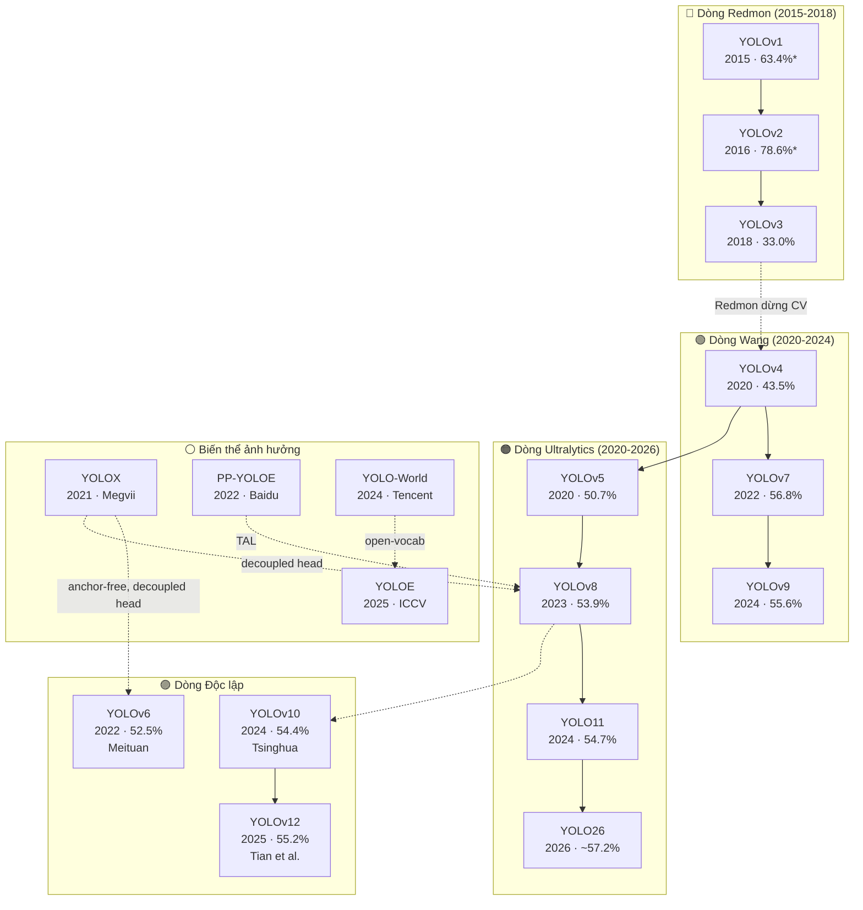

# Chương 7: CÁC BIẾN THỂ YOLO

## 7.1. YOLOX (2021) — Anchor-Free tiên phong

**Tác giả:** Megvii | **Giải thưởng:** 1st Place, CVPR 2021 Streaming Perception [15]

3 đóng góp mở đường cho YOLO sau này:

| Đóng góp | Ý nghĩa | Được adopt bởi |
|:--|:--|:--|
| **Anchor-Free** | Chứng minh YOLO hoạt động tốt không cần anchor | v6, v8+ |
| **Decoupled Head** | Tách cls/reg thành 2 branches riêng biệt | v6, v8, v11, v12 |
| **SimOTA** | Dynamic label assignment | Tiền nhiệm của TAL |

YOLOX-L: 50.0% mAP, 69 FPS (V100). Nano variant: chỉ 0.91M params [15].

## 7.2. PP-YOLOE (2022) — Baidu Industrial

**Tác giả:** Baidu | **Framework:** PaddlePaddle [16]

**TAL (Task Alignment Learning):** Alignment metric $t = s^\alpha \times u^\beta$ đảm bảo cls score cao ↔ localization tốt. Kỹ thuật này được **YOLOv8, v9, v10+** adopt [16].

PP-YOLOE+-L: 53.3% mAP, 78 FPS. Phổ biến trong công nghiệp Trung Quốc [16].

## 7.3. YOLO-NAS (2023) — AI thiết kế AI

**Tác giả:** Deci AI (Israel) [17]

**AutoNAC:** Khám phá ~$10^{14}$ kiến trúc, tự tìm tối ưu. Thiết kế sẵn cho quantization: INT8 chỉ mất **0.4–0.6% mAP** (các model khác mất 1–2%) [17].

## 7.4. YOLO-World (2024) — Tiền nhiệm YOLOE

**Tác giả:** Tencent AI Lab [18]

Open-vocabulary đầu tiên cho YOLO. **RepVL-PAN** kết hợp CLIP text embeddings vào feature pyramid. Prompt-then-Detect: nạp text 1 lần, detect real-time. YOLOE sau đó cải tiến thêm visual prompt + prompt-free [18].

---

# Chương 8: SO SÁNH TỔNG HỢP & ĐÁNH GIÁ

## 8.1. Bảng tổng quan tất cả phiên bản

| Version | Năm | mAP (best) | Params | Anchor | NMS | Multi-Task | Paper |
|:--|:-:|:-:|:-:|:-:|:-:|:-:|:-:|
| v1 [1] | 2015 | 63.4%* | ~45M | Không | Cần | Không | Có |
| v2 [2] | 2016 | 78.6%* | ~50M | Có | Cần | Không | Có |
| v3 [3] | 2018 | 33.0% | ~62M | Có | Cần | Không | Có |
| v4 [4] | 2020 | 43.5% | ~64M | Có | Cần | Không | Có |
| v5 [5] | 2020 | 50.7% | 86.7M | Có | Cần | Hạn chế | Không |
| v6 [6] | 2022 | 52.5% | ~58M | Không | Cần | Không | Có |
| v7 [7] | 2022 | 56.8% | ~71M | Có | Cần | Hạn chế | Có |
| v8 [8] | 2023 | 53.9% | 68.2M | Không | Cần | 6 tác vụ | Không |
| v9 [9] | 2024 | 55.6% | 58.1M | Không | Cần | Hạn chế | Có |
| v10 [10] | 2024 | 54.4% | 29.5M | Không | Không | Không | Có |
| YOLO11 [11] | 2024 | 54.7% | 56.9M | Không | Không | 6 tác vụ | Không |
| v12 [12] | 2025 | 55.2% | 59.1M | Không | Không | Có | Có |
| YOLOE [13] | 2025 | 27.1%** | ~25M | Không | Tùy | Có | Có |
| YOLO26 [14] | 2026 | ~57.2% | ~60M | Không | Không | 5 tác vụ | Không |

> *\* VOC mAP@50 — không so sánh trực tiếp với COCO mAP@50:95*  
> *\*\* LVIS zero-shot — thang đo hoàn toàn khác COCO closed-set*

## 8.2. Tiến hóa kiến trúc

| Thành phần | Tiến hóa |
|:--|:--|
| **Backbone** | 24-layer CNN → Darknet-19 → Darknet-53 → CSPDarknet → EfficientRep → E-ELAN → GELAN → Area Attention |
| **Anchor** | Grid (v1) → Anchor-based (v2–v7) → Anchor-free (v6, v8+) → NMS-free (v10+) |
| **Loss** | MSE (v1) → IoU → GIoU → CIoU (v4) → CIoU+DFL (v8) → Bỏ DFL (YOLO26) |
| **Framework** | Darknet C (v1–v4) → PyTorch `pip install` (v5+) → Unified API (v8+) |

## 8.3. Các phiên bản "thua" đời trước — Phân tích trade-off

| Trường hợp | Thua ở đâu | Thắng ở đâu |
|:--|:--|:--|
| v8 thua v7 [7][8] | mAP: 53.9% < 56.8% | Multi-task (6 tác vụ), ecosystem, dễ dùng |
| v10 thua v9 [9][10] | mAP: 54.4% < 55.6% | Params ít 2×, NMS-free, latency ổn định |
| v3 chậm hơn v2 [2][3] | FPS: 20–51 < 40–67 | Accuracy tốt hơn nhiều (+10%) |

> **Bài học:** Không version nào thua hoàn toàn. Mỗi "thua" là **trade-off có chủ đích** — hy sinh một metric để cải thiện metric khác phù hợp mục tiêu thiết kế.

## 8.4. Xếp hạng theo tiêu chí

### Accuracy thuần túy (mAP@50:95 COCO)
1. YOLO26: ~57.2% [14]
2. YOLOv7-E6E: 56.8% [7]
3. YOLOv9-E: 55.6% [9]
4. YOLOv12-X: 55.2% [12]
5. YOLO11-X: 54.7% [11]

### Efficiency (mAP/Params)
YOLOv10-X dẫn đầu: 54.4% mAP với chỉ **29.5M params** (1.84 mAP/M) [10].

### Đóng góp lý thuyết
1. **YOLOv1** [1]: Single-stage detection — thay đổi cả lĩnh vực
2. **YOLOv9** [9]: Information Bottleneck + PGI — lý thuyết sâu nhất
3. **YOLOv4** [4]: BoF/BoS methodology — hệ thống hóa toàn diện
4. **YOLOv10** [10]: NMS-free — giải quyết vấn đề tồn tại 9 năm
5. **YOLOv12** [12]: Attention-centric — mở kỷ nguyên mới

### Production readiness (2026)
YOLO11 > YOLOv8 > YOLO26 > YOLOv12

## 8.5. Sơ đồ phả hệ (Family Tree)

## 8.6. Xu hướng phát triển

1. **CNN → Attention:** v12 mở đầu, tương lai sẽ hybrid CNN+Attention
2. **Closed-set → Open-vocabulary:** YOLOE cho phép detect vật chưa train [13]
3. **Server → Edge:** YOLO26 tối ưu CPU, INT8, mobile [14]
4. **NMS → NMS-free:** End-to-end detection từ v10 [10]
5. **CV ← NLP:** Cross-pollination từ LLM (MuSGD, CLIP) [14]
6. **Detection → Multi-task:** 1 model cho detect+segment+pose+track [8][11]

---

# Chương 9: KẾT LUẬN & KHUYẾN NGHỊ

## 9.1. Tổng kết

Qua 11 năm phát triển (2015–2026), YOLO đã trải qua hành trình đáng chú ý:

- **Accuracy:** Từ 63.4% (VOC, v1) lên ~57.2% (COCO, YOLO26) — cải thiện liên tục trên benchmark khó hơn nhiều
- **Kiến trúc:** Từ CNN 24 lớp thô sơ → Attention-centric với Area Attention
- **Detection paradigm:** Grid → Anchor → Anchor-free → NMS-free
- **Phạm vi:** Từ detection only → 6 tác vụ + open-vocabulary
- **Ecosystem:** Từ compile C code → `pip install`, 1 dòng code train
- **3 dòng phát triển:** Redmon (v1–v3), Wang (v4,v7,v9), Ultralytics (v5,v8,v11,v26)

> **Bài học quan trọng nhất:** Đời sau **không phải lúc nào cũng tốt hơn** đời trước ở mọi tiêu chí. Mỗi version tối ưu cho mục đích khác nhau.

## 9.2. Khuyến nghị chọn model

| Mục đích | Chọn | Lý do |
|:--|:--|:--|
| Accuracy tối đa | YOLO26-X / v7-E6E | mAP cao nhất [7][14] |
| Dễ dùng, đa năng | v8 / YOLO11 | pip install, 6 tasks [8][11] |
| Deploy edge/mobile | YOLO26-N / v10-N | NMS-free, CPU nhanh [10][14] |
| Ít params nhất | YOLOv10-X | 29.5M cho 54.4% [10] |
| Real-time cực nhanh | YOLOv6-S | 520+ FPS (TensorRT) [6] |
| Detect vật chưa train | YOLOE | Open-vocab, 3 chế độ [13] |
| Vật nhỏ (drone) | YOLO26 | STAL chuyên vật nhỏ [14] |
| INT8 quantization | YOLO-NAS | Mất chỉ 0.4% [17] |
| Học/nghiên cứu | v1→v4 papers | Nền tảng lý thuyết [1]–[4] |

## 9.3. Lời cuối

> *"Sự thật cuối cùng: Chênh lệch 1–3% mAP giữa các version trên COCO có thể không có ý nghĩa thống kê trên dataset thực tế. **Data chất lượng quan trọng hơn chọn model.**"*

---

# PHỤ LỤC: BẢNG THUẬT NGỮ

## Kiến trúc mạng

| Thuật ngữ | Giải thích |
|:--|:--|
| **Backbone** | Phần "xương sống", trích xuất features từ ảnh (Darknet, CSPDarknet, ResNet) |
| **Neck** | Kết nối Backbone-Head, kết hợp features nhiều scales (FPN, PAN) |
| **Head** | Phần cuối, dự đoán bounding boxes và classes |
| **CNN** | Convolutional Neural Network — mạng dùng phép tích chập trích xuất features |
| **Residual Connection** | Đường tắt: $y = F(x) + x$. Giải quyết vanishing gradient (ResNet) |
| **CSP** | Cross Stage Partial — chia features 2 phần, giảm 20% computation |
| **FPN** | Feature Pyramid Network — kết hợp features nhiều scales |
| **Re-parameterization** | Training multi-branch, inference single-branch. Gộp weights bằng phép cộng |
| **Attention** | Cơ chế "tập trung" vào vùng quan trọng. Self-attention: global receptive field |
| **FlashAttention** | Thuật toán tính attention tối ưu memory |

## Kỹ thuật Detection

| Thuật ngữ | Giải thích |
|:--|:--|
| **Anchor Box** | Hộp mẫu định nghĩa trước. Model dự đoán offsets. v2–v7 dùng, v8+ bỏ |
| **Anchor-free** | Dự đoán trực tiếp center point + 4 distances. Đơn giản hơn |
| **NMS** | Non-Maximum Suppression — loại bỏ boxes trùng lặp |
| **NMS-free** | Model tự output 1 box/vật. Từ v10 (dual assignment) |
| **Decoupled Head** | Tách classification và regression thành 2 branches riêng |
| **Label Assignment** | Chiến lược gán prediction cho ground truth (SimOTA, TAL, STAL) |

## Metrics

| Thuật ngữ | Giải thích |
|:--|:--|
| **IoU** | Intersection over Union — đo mức trùng lặp 2 boxes (0→1) |
| **mAP@50** | AP ở ngưỡng IoU ≥ 0.5. Metric chính VOC |
| **mAP@50:95** | Trung bình AP ở IoU 0.5→0.95. Metric chính COCO — khắt khe hơn |
| **FPS** | Frames Per Second. ≥30 FPS = real-time |
| **Params** | Số tham số model. 3.2M = 3.2 triệu. Ít params = model nhẹ |
| **FLOPs** | Floating Point Operations — đo computational cost |

## Training & Deployment

| Thuật ngữ | Giải thích |
|:--|:--|
| **Mosaic** | Ghép 4 ảnh thành 1 — augmentation mạnh. v4 giới thiệu |
| **Quantization** | Giảm precision (FP32→INT8) — model nhẹ 4×, có thể mất accuracy |
| **BoF/BoS** | Bag of Freebies/Specials — kỹ thuật tăng accuracy miễn phí/có phí nhẹ |
| **TensorRT** | NVIDIA SDK tối ưu inference trên GPU. Tăng 2–5× speed |
| **ONNX** | Format chuẩn export model, chạy trên nhiều hardware |

---

# TÀI LIỆU THAM KHẢO

| # | Tài liệu |
|:-:|:--|
| [1] | J. Redmon et al., "You Only Look Once: Unified, Real-Time Object Detection," CVPR 2016. arXiv:1506.02640 |
| [2] | J. Redmon, A. Farhadi, "YOLO9000: Better, Faster, Stronger," CVPR 2017. arXiv:1612.08242 |
| [3] | J. Redmon, A. Farhadi, "YOLOv3: An Incremental Improvement," 2018. arXiv:1804.02767 |
| [4] | A. Bochkovskiy et al., "YOLOv4: Optimal Speed and Accuracy of Object Detection," 2020. arXiv:2004.10934 |
| [5] | G. Jocher, "YOLOv5," Ultralytics, 2020. github.com/ultralytics/yolov5 |
| [6] | C. Li et al., "YOLOv6: A Single-Stage Object Detection Framework for Industrial Applications," 2022. arXiv:2209.02976 |
| [7] | C.-Y. Wang et al., "YOLOv7: Trainable Bag-of-Freebies," CVPR 2023. arXiv:2207.02696 |
| [8] | G. Jocher, "YOLOv8," Ultralytics, 2023. github.com/ultralytics/ultralytics |
| [9] | C.-Y. Wang et al., "YOLOv9: Learning What You Want to Learn Using PGI," 2024. arXiv:2402.13616 |
| [10] | A. Wang et al., "YOLOv10: Real-Time End-to-End Object Detection," 2024. arXiv:2405.14458 |
| [11] | G. Jocher, "YOLO11," Ultralytics, 2024. github.com/ultralytics/ultralytics |
| [12] | Y. Tian et al., "YOLOv12: Attention-Centric Real-Time Object Detectors," 2025. arXiv:2502.12524 |
| [13] | "YOLOE: Real-Time Seeing Anything," ICCV 2025. arXiv:2503.07465 |
| [14] | G. Jocher, "YOLO26," Ultralytics, 2026. github.com/ultralytics/ultralytics |
| [15] | Z. Ge et al., "YOLOX: Exceeding YOLO Series in 2021," 2021. arXiv:2107.08430 |
| [16] | S. Xu et al., "PP-YOLOE: An Evolved Version of YOLO," 2022. arXiv:2203.16250 |
| [17] | "YOLO-NAS," Deci AI, 2023. github.com/Deci-AI/super-gradients |
| [18] | T. Cheng et al., "YOLO-World: Real-Time Open-Vocabulary Object Detection," 2024. arXiv:2401.17270 |
